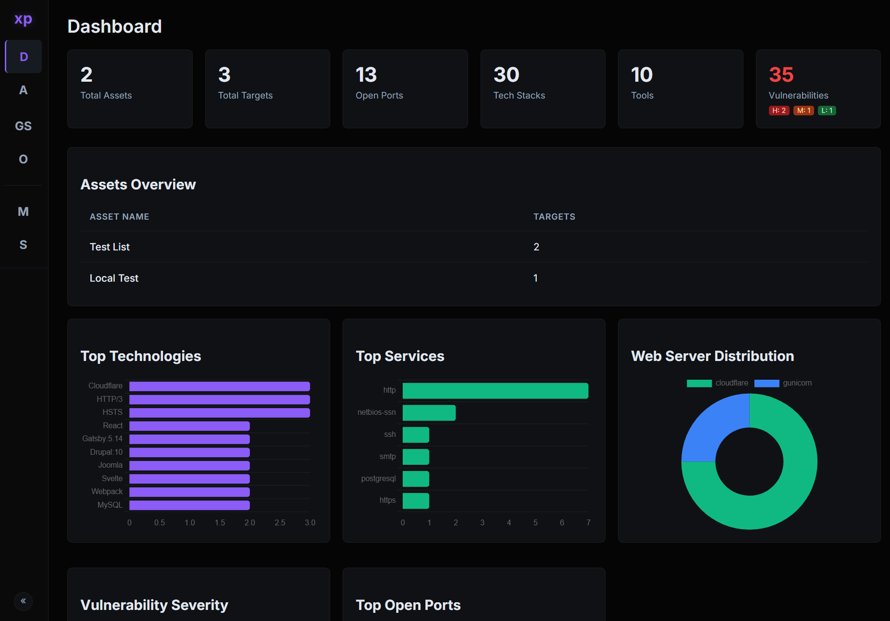
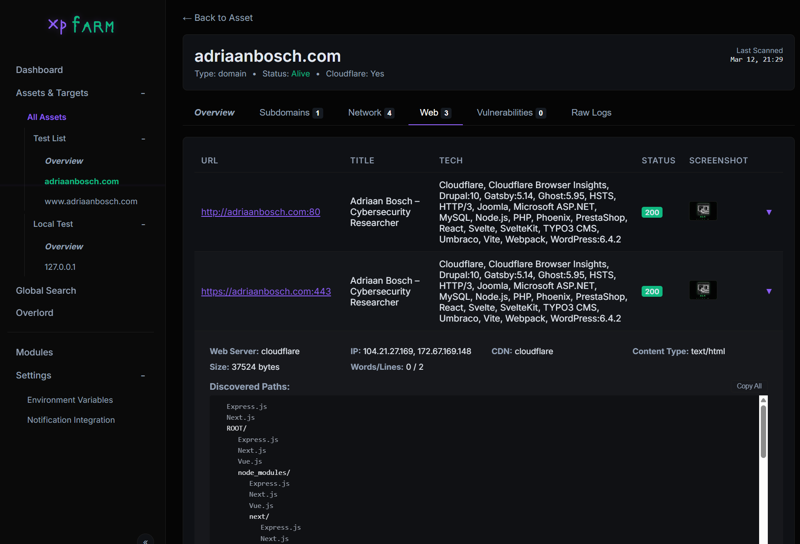
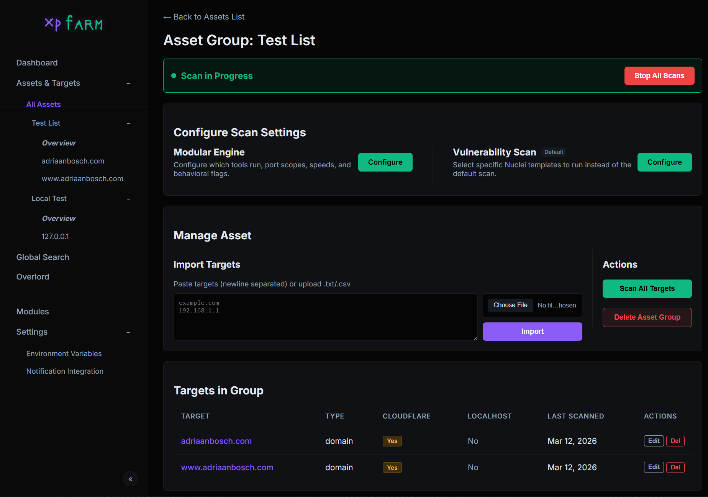
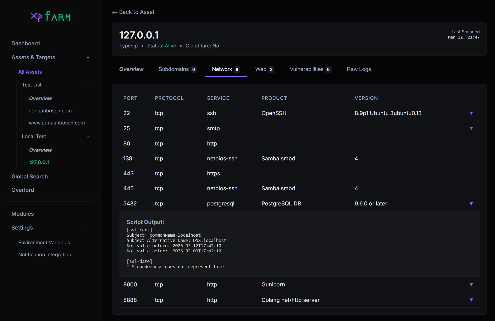
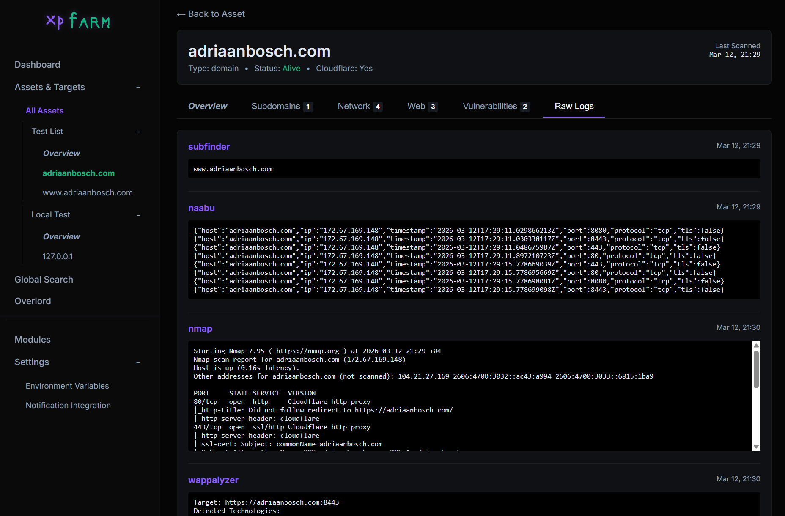

# XPFarm

An open-source vulnerability scanner that wraps well-known open-source security tools behind a single web UI.



## Why

Tools like [Assetnote](https://www.assetnote.io/) are great — well maintained, up to date, and transparent about vulnerability identification. But they're not open source. There's no need to reinvent the wheel either, as plenty of solid open-source tools already exist. XPFarm just wraps them together so you can have a vulnerability scanner that's open source and less corporate.

The focus was on building a vuln scanner where you can also see what fails or gets removed in the background, instead of wondering about that mystery.

## Wrapped Tools

- [Subfinder](https://github.com/projectdiscovery/subfinder) — subdomain discovery
- [Naabu](https://github.com/projectdiscovery/naabu) — port scanning
- [Httpx](https://github.com/projectdiscovery/httpx) — HTTP probing
- [Nuclei](https://github.com/projectdiscovery/nuclei) — vulnerability scanning
- [Nmap](https://nmap.org/) — network scanning
- [Katana](https://github.com/projectdiscovery/katana) — crawling
- [URLFinder](https://github.com/projectdiscovery/urlfinder) — URL discovery
- [Gowitness](https://github.com/sensepost/gowitness) — screenshots
- [Wappalyzer](https://github.com/projectdiscovery/wappalyzergo) — technology detection
- [CVEMap](https://github.com/projectdiscovery/cvemap) — CVE mapping



## Setup

```bash
# Docker Compose (recommended)
docker-compose up --build

# Standard Docker
docker build -t xpfarm .
docker run -p 8888:8888 -v $(pwd)/data:/app/data -v $(pwd)/screenshots:/app/screenshots xpfarm

# Build from source
go build -o xpfarm
./xpfarm
./xpfarm -debug
```

## Screenshots







## TODO

- [ ] Agent Hell

### NTH
- [ ] SecretFinder JS
- [ ] Repo detect/scan
- [ ] Mobile scan
- [ ] Custom Module?
